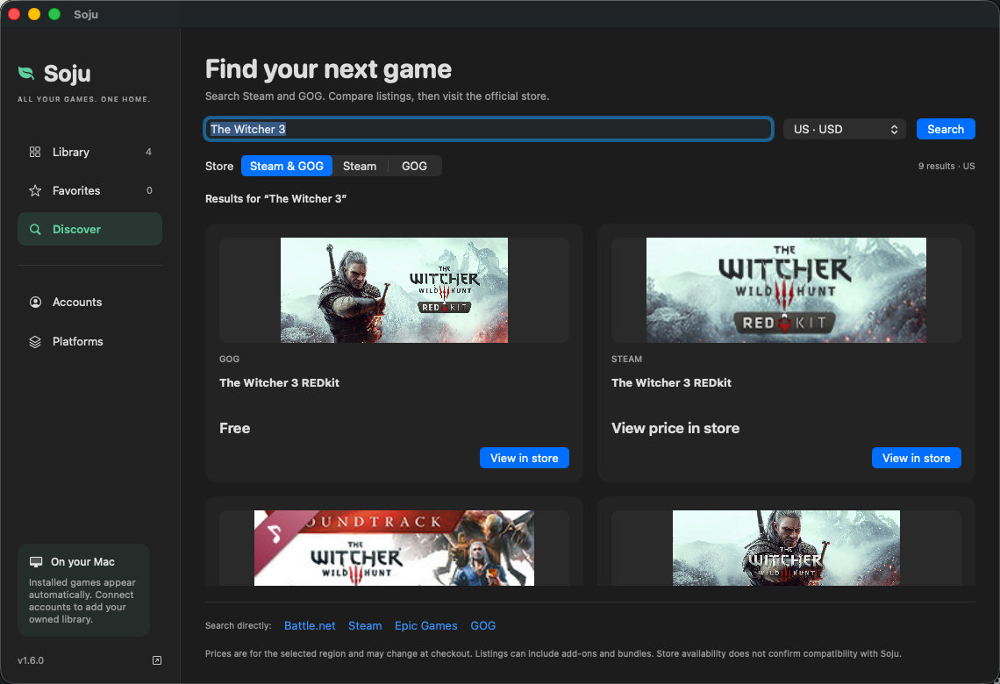

# Soju

> **Free, open-source game library and launcher for Apple Silicon Macs.**

Bring installed games from **Battle.net, Steam, Epic Games and GOG GALAXY**
into one native Mac library. Search, filter, favorite and launch games through
their official Windows clients. The Platforms page handles launcher setup,
component updates and diagnostics; the CLI and individual shortcuts remain available.

Sign in to **Steam** to import your owned library, or import the
owned library cached by **GOG GALAXY**. Installed and uninstalled games share the
same library, with availability filters and official-client install actions.
**Discover** searches Steam and GOG listings and prices, with links to buy from the stores. Purchases, downloads and updates stay with the official stores.
Epic and Battle.net account imports are not included yet. Compatibility varies by game.




[Account connections and store search](docs/ACCOUNTS.md) · Official Steam sign-in, no API key required. Account imports stay on your Mac.

The tools are free and open source. The main Wine engine is built from
CodeWeavers' published sources; Steam uses a separate private Wine 11 setup.
Apple's proprietary GPTK/D3DMetal is downloaded separately. Games and store
clients are not included.

**Current release: [v1.6.5](https://github.com/BCD1210/soju/releases/tag/v1.6.5).**
The compatibility examples below were verified on M4 Pro / macOS 26.5.
D2R and Hogwarts Legacy are examples of supported games, not the scope of the project.

[Watch the 30-second gameplay demo](https://soju.snack-wrap.com/#demo) · Hogwarts Legacy / Epic + Guilt Free / Steam (custom DXMT)

*[한국어 README](README.ko.md) · [简体中文说明](README.zh.md)*

## Support Soju

Help keep Soju free and open source. [Support Soju](https://soju.snack-wrap.com/support.html) brings together ways to contribute, voluntary support updates and information about game purchase links.

## What runs

<!-- Screenshots: drop PNGs into docs/images/ (d2r-ingame.png, battlenet-login.png, hogwarts-ingame.png) and uncomment.
<p align="center">
  
  
</p>
-->

All verified on an M4 Pro running macOS 26.5. Separate bottles for each launcher; Steam uses its own engine.

| Launcher | Login | Install games | Notes |
| --- | :-: | :-: | --- |
| Battle.net | ✅ | ✅ | Agent works; `BLZBNTBNA00000005` fixed by the caller-signature seed |
| Epic Games Launcher | ✅ | ✅ | parks in the menu bar tray on close |
| GOG GALAXY | ✅ | ✅ | login + library; games not broadly tested yet |
| Steam (Windows client) | ✅ | ✅ | private Wine 11 + DXMT bottle |

| Game | Store | Graphics | Status | Notes |
| --- | --- | --- | :-: | --- |
| Diablo II: Resurrected | Battle.net | D3DMetal (D3D11) | ✅ in-game, online | **macOS 26.4 or later** (see prerequisites); `play.sh` sets `ROSETTA_ADVERTISE_AVX=1`; [guide](https://bcd1210.github.io/soju/guides/diablo-2-resurrected-apple-silicon.html) |
| Hogwarts Legacy | Epic | D3DMetal (D3D12) | ✅ in-game | UE4 "AMD driver" warning is harmless |
| Unity D3D11 title | Steam | DXMT | ✅ in-game, windowed | via `soju steam-games`; see [docs/STEAM-GAMES.md](docs/STEAM-GAMES.md) |
| Diablo II: Resurrected (Infernal Edition) | Steam | — | ⏳ not verified yet | the Steam bottle has no GPTK, and D2R's loader needs `libd3dshared` |

Will not run: anything with kernel anti-cheat (EAC, BattlEye, Vanguard). Got another game running? Post it in [Discussions](https://github.com/BCD1210/soju/discussions) or send a PR that adds a row.

## Why this exists

Community Wine builds (Whisky, Kegworks-era engines) stopped working with modern Battle.net and D2R. The commercial option works, but the underlying Wine engine is GPL, so we built it ourselves and documented every wall we hit. The investigation and fixes are documented below:

### The three keys

1. **`ROSETTA_ADVERTISE_AVX=1`**: D2R's loader requires AVX instructions. Without this env var, the game freezes forever at ~86 MB RSS with 0% CPU, before any graphics init. This is why D2R "hangs at launch" on non-CrossOver Wine builds.

2. **D3DMetal payload layout**: Apple's Game Porting Toolkit payload is three parts, and D3DMetal engages only with all three: `lib/external/` (libd3dshared + D3DMetal.framework), Apple's PE shims `d3d11.dll`, `d3d12.dll`, `dxgi.dll` (plus `atidxx64`, `nvapi64`, `nvngx`) replacing Wine's own in `lib/wine/x86_64-windows/`, and one `lib/wine/x86_64-unix/<shim>.so` per shim as a **symlink** into `lib/external/`. Copying real files there breaks `@loader_path` resolution and D3DMetal dies in an assertion loop; leaving Wine's own `d3d11.dll` in place runs D3D on wined3d instead, and the Epic Games Launcher crashes at start on that. `soju gptk` installs all three parts.

3. **Battle.net Agent caller-signature fix**: the Agent verifies the signature of the connecting client using a relative filename resolved against its CWD (a versioned subfolder). Seeding a copy of the signed `Battle.net.exe` into each `Battle.net.NNNNN` subfolder makes verification pass (fixes error `BLZBNTBNA00000005`).

Plus one trap: never put Apple platform binaries (`nohup`, `arch`, …) in the launch chain. macOS strips `DYLD_*` variables when exec'ing them.

**Guides:** [D2R on Apple Silicon](https://bcd1210.github.io/soju/guides/diablo-2-resurrected-apple-silicon.html) · [Windows Steam client](https://bcd1210.github.io/soju/guides/steam-windows-client-apple-silicon.html) · [Whisky alternatives](https://bcd1210.github.io/soju/guides/whisky-alternative.html)

## Install (one line)

```bash
curl -fsSL soju.snack-wrap.com/install.sh | bash
```

Or via Homebrew:

```bash
brew install BCD1210/soju/soju
soju install     # then: soju battlenet / soju d2r / soju steam / soju epic / soju gog
```

The installer asks which launchers you want **before downloading anything**. Steam-only installs skip the CX engine and Apple GPTK. Steam rendering components are downloaded with SHA-256 verification and installed in a Soju-owned Wine 11.0 runtime. Battle.net, Epic and GOG use the shared CX engine and your separately downloaded Apple GPTK. Each official client keeps its own bottle and shortcut in `~/Applications`.

[Download Soju for Mac](https://github.com/BCD1210/soju/releases/download/v1.6.5/Soju-1.6.5-macos-arm64.zip) — the native desktop preview includes installed and owned games, store search, favorites, game launching and platform management. See [desktop setup and requirements](docs/DESKTOP.md).

## Everyday commands

```bash
soju doctor      # checks the whole stack and prints what is wrong (paste this into bug reports)
soju update      # updates the scripts and the prebuilt engine, keeping GPTK and every bottle
soju uninstall   # removes apps, bottles and the engine, asking before each one
```

## Build it yourself instead: no CrossOver required

The only thing you download outside this repo's scripts is Apple's free Game Porting Toolkit (one file, needs a free Apple ID). Apple forbids redistributing it.

```bash
# 1. Get the scripts
git clone https://github.com/BCD1210/soju.git && cd soju

# 2. Fetch runtime components (x86_64 dylibs + wine-mono, all from free GPL releases)
scripts/get-components.sh

# 3. Build the engine from GPL sources (30-60 min)
scripts/build-engine.sh

# 4. Install Apple GPTK payload (download the "evaluation environment for Windows
#    games" dmg from https://developer.apple.com/games/game-porting-toolkit/ ,
#    mount it, then:)
scripts/get-gptk.sh
#    (if you happen to have CrossOver installed, the script auto-extracts from it instead)

# 5. Create a bottle + install Battle.net (official Blizzard installer, fully automatic)
scripts/create-bottle.sh

# 6. Play
scripts/play.sh battlenet   # launcher -> log in -> install & play your game (closing the window exits, as on Windows; if you set "minimize to tray" in its settings, a Dock-icon click brings it back)
scripts/play.sh d2r         # direct game launch (offline)
scripts/play.sh kill        # stop everything
```

Already have a CrossOver bottle with games installed? `scripts/setup-bottle.sh` clones it (28 GB game re-download avoided).

## Epic Games Launcher

Same engine, own bottle, no extra tricks: Epic's CEF keeps its GPU process alive on this build, so the launcher runs with its stock command line. Verified 2026-08-29: unattended install from the official MSI (~30 s), launcher UI, login.

```bash
scripts/create-epic-bottle.sh    # official Epic MSI, unattended
scripts/play.sh epic             # log in -> install & play
scripts/play.sh epic-kill        # stop the Epic bottle (closing the window parks the launcher in the menu bar tray; click the Dock icon, or double-click / right-click the menu bar icon, to bring it back)
```

Verified 2026-08-30: 71 GB install of Hogwarts Legacy (UE4, D3D12 through D3DMetal) from the launcher, then in-game. Two things to know: a Korean/Japanese/Chinese input source no longer matters (engine-v1.5 builds the key tables from the ASCII layout the input method sits on, as Windows does, so you can switch to Korean and back mid-game); and if a game starts full screen, set windowed mode in its own display settings (Soju does not force it). One known wine 11.0 issue: after switching between several Wine windows (a launcher, a game, another bottle) a game can stop receiving keyboard input until it is restarted; upstream fixed this in wine 11.11.

### GOG GALAXY

```bash
scripts/create-gog-bottle.sh      # separate bottle, official web installer (silent)
scripts/play.sh gog               # log in, install and play
scripts/play.sh gog-kill          # stop the GOG bottle (closing the window parks GOG in the menu bar tray; a Dock-icon click brings it back)
```

Verified 2026-08-30: install, login, library. GOG GALAXY 2.x is Qt6 + QtWebEngine, not CEF, and on this engine its window stays black because Qt's D3D11 compositing asks D3DMetal's DXGI for `IDXGIResource`, which it does not implement. The fix is to run Chromium on the CPU (`--disable-gpu`), but GOG overwrites `QTWEBENGINE_CHROMIUM_FLAGS` itself and ignores its own command line, and it checksums its executable, so nothing outside the engine can inject the switch. The engine therefore carries a small hook (`patches/chromium-flags-append.patch`): whenever a program sets `QTWEBENGINE_CHROMIUM_FLAGS`, the contents of `SOJU_CHROMIUM_FLAGS` are appended. `play.sh gog` sets it. The same patch set adds `WINE_CUSTOM_FRAME`, which stops the Mac driver from putting a macOS title bar on top of GOG's own. Details in [docs/DIAGNOSIS.md](docs/DIAGNOSIS.md).

Games have not been broadly tested yet; anything that needs kernel anti-cheat (EAC/BattlEye) will not run under Wine.

## Steam (including the Steam version of D2R)

D2R shipped on Steam in Feb 2026 as the *Infernal Edition*. Steam support uses a **different free engine**: the modern Steam client's CEF UI does not render on CrossOver-source builds (black window, cross-process swapchain + CEF sandbox issues), but it works on a pinned upstream Wine 11 build with a tiny `steamwebhelper` wrapper that forces `--disable-gpu --single-process`. That fix comes from [notpop/steam-on-m1-wine](https://github.com/notpop/steam-on-m1-wine) (MIT, wrapper source vendored in `third_party/`). Steam gets its own bottle so the two stacks never interfere:

```bash
scripts/create-steam-bottle.sh   # installs private Wine 11 + wrapper + official Valve installer
scripts/play.sh steam            # log in -> install & play
scripts/play.sh steam-kill       # stop the Steam bottle (closing the window keeps Steam running; click the Dock icon to bring it back, Steam > Exit quits)
```

Verified on M4 Pro / macOS 26.5: login, library, and an actual D3D11 (Unity) game rendering in-game via a DXMT fork. See `docs/STEAM-GAMES.md` for the full wiring (`scripts/setup-steam-games.sh`). Notes: switch your macOS input source to English (ABC) when typing in Steam (IME composition shows as `?` otherwise).

**Prerequisites**: Apple Silicon Mac, Rosetta 2, Xcode Command Line Tools, Homebrew, your own Battle.net account/games, and a free Apple ID for the GPTK download. **Diablo II: Resurrected needs macOS 26.4 or later**: the anti-cheat Blizzard added in January 2026 trips a Rosetta 2 bug that Apple fixed in 26.4, and on macOS 15 the game dies right after launch (Battle.net then shows "Update" and sits at Initializing) on Soju and on CrossOver alike. The launchers themselves and other games are not affected by that bug, but everything here was verified on macOS 26.5 only. Nothing from Apple, Blizzard, or CodeWeavers is redistributed by this repo.

### Why is GPTK needed at all?

`libd3dshared.dylib` (inside GPTK) is not just graphics: D2R's loader requires its *non-native code region registration* to get through Rosetta 2. Without it the game freezes at launch even with AVX advertised. Graphics itself can run on pure open-source vkd3d/MoltenVK if D3DMetal is absent.

### Troubleshooting

Start with `soju doctor`: it checks most of the items below and tells you which one is broken.

- **"Wine Mono Installer" popup** -> step 2 was skipped; run `get-components.sh` then re-run `build-engine.sh`.
- **Game hangs forever at ~86 MB RAM, 0% CPU** -> `ROSETTA_ADVERTISE_AVX=1` or `libd3dshared` not reaching the game. Launch via `play.sh` only, and check step 4.
- **Libraries not found (gnutls/freetype errors)** -> you launched wine through `nohup`/`arch`/another Apple-signed binary, which strips `DYLD_*` vars. Launch via `play.sh`.
- **Battle.net login webview may flicker (~once a minute)** -> known cosmetic issue; it recovers automatically and login works.
- **"The installed version of the AMD graphics driver has known issues" when an Unreal Engine game starts** (Hogwarts Legacy and others): D3DMetal presents itself as an AMD adapter with an old driver version, so UE4's driver check fires. Harmless, click OK; to silence it add `[SystemSettings]` / `r.WarnOfBadDrivers=0` to the game's user `Engine.ini` (under `AppData/Local/<Game>/Saved/Config/WindowsNoEditor/`).
- **GOG GALAXY: a black rectangle appears at the bottom right while a notification toast is shown** and disappears with it. The toast is a transparent layered window from GOG's notifications renderer; without DWM composition Wine paints its transparent area black. Harmless. Turning off desktop notifications in GOG's settings avoids it.
- **A movement key stays pressed, or the keyboard goes dead while the mouse still works** (seen in Hogwarts Legacy): keyboard focus moved to another Wine window while the key was held. The usual culprit is the Epic (EOS) overlay, which is why `soju epic` now disables it (`SOJU_EPIC_OVERLAY=1` brings it back; restart the launcher with `soju epic-kill` for the change to apply). On engines before v1.5 a Korean/Japanese/Chinese input source is a second cause: the letter keys then produce jamo or kana, which Unreal games drop (only Escape, arrows and function keys work) and a key held during the switch stays down; keep the input source on English (ABC) there, or update the engine (`soju update`). Still happening? `SOJU_KEYLOG=1 soju epic` writes a key/focus trace to `~/.battlenet-macos/logs/` to attach to an issue.
- **Epic: "your account has too many active logins"** and logging out everywhere or resetting the password does not help. The account service is really answering `too_many_sessions` (18048), a limit on how many sessions were *issued*, not how many are held, so retrying makes it worse. Older engines hit this within a handful of launches because Wine could not keep the launcher's device key: see `patches/ncrypt-persisted-keys.patch`. Stop the bottle (`soju epic-kill`), leave it alone for a few hours so the counter clears, then start it once.
- **Battle.net shows "Update" (stuck at Initializing) and the Play button is gone** after a game exits, or after a launch that died: the launcher re-checks the install every time a game process ends. Pause the update and resume it; Play comes back and the game starts normally. If the very first Play after an install dies within a minute, press Play again: seen once, the second launch went through.
- **BLZBNTBNA00000005** -> `play.sh` seeds the signed exe automatically; make sure you launch through it.

### Leftover Wine processes

Every bottle start also spawns idle Windows service processes (`services.exe`, `winedevice.exe`, `plugplay.exe`, `rpcss.exe`, `explorer.exe /desktop`, ~100 MB per set). If a bottle's `wineserver` is killed abruptly (a crash, an aborted run), those services never notice and linger. `scripts/soju-sweep.sh` removes them, and `play.sh kill` / `epic-kill` / `steam-kill` and the reaper call it automatically. It only removes service processes that belong to no running `wineserver` (every live bottle's processes hold a file open in their server's socket directory), so a live game or launcher is never touched, even while other bottles are up. `soju sweep` runs it by hand.

## What's in the repo

- `scripts/build-engine.sh`: full engine build recipe (freetype cross-build, gnutls wiring, GPTK layout, entitlements)
- `scripts/setup-bottle.sh` / `scripts/play.sh`: bottle creation and the verified launch environment
- `docs/DIAGNOSIS.md`: deep-dive on the CEF renderer crash and the Agent signature failure
- `docs/D2R-GAME-LAUNCH.md`: the D2R loader investigation, dead ends included
- `research/`: raw log evidence for the findings

## Licensing

- Scripts and docs in this repo: **GPL-3.0** (see LICENSE)
- The engine is built from CodeWeavers' published Wine sources (GPL/LGPL). Sources:  `media.codeweavers.com/pub/crossover/source/`
- **Not included and never will be**: Apple D3DMetal/GPTK binaries (non-redistributable), CrossOver application binaries, any Blizzard files
- This project is not affiliated with CodeWeavers, Apple, or Blizzard Entertainment. Battle.net and Diablo are trademarks of Blizzard Entertainment. Use at your own risk; online play with third-party compatibility layers is at your own discretion.

## Share your compatibility results

Tried a game on your Mac? Report successes, partial support or failures with the game, store, Mac model, macOS and Soju setup. GitHub sign-in required; reports are public.

[Share your compatibility results](https://github.com/BCD1210/soju/issues/new?template=compatibility.yml)
