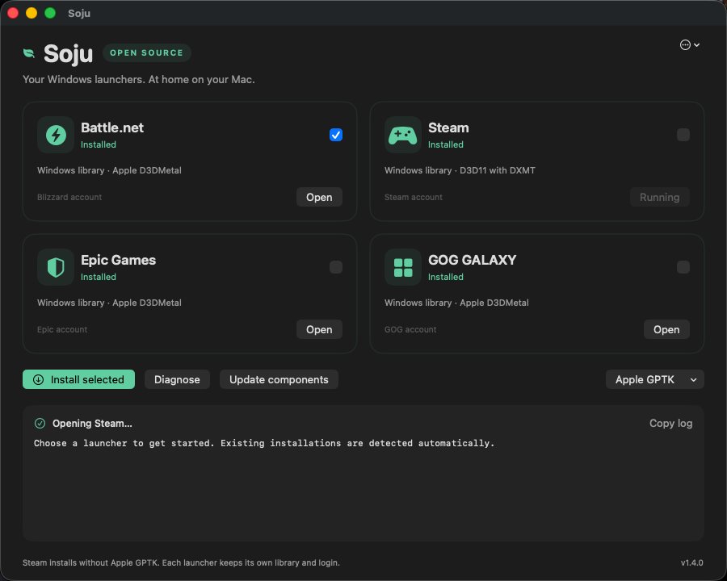

# Soju for Mac

[Download v1.4.0](https://github.com/BCD1210/soju/releases/download/v1.4.0/Soju-1.4.0-macos-arm64.zip)

1. Unzip and move **Soju.app** into Applications or ~/Applications.
2. Open it and select Battle.net, Steam, Epic Games or GOG GALAXY.
3. Click **Install selected**. Existing installations are detected.
4. Use **Open**, **Diagnose**, and **Update components** from the same window.

This is the first native desktop preview. The app is ad-hoc signed, not
Developer ID signed or notarized. If macOS blocks the downloaded app, review
the source and use macOS Privacy & Security's Open Anyway flow if you trust it.
A local source build is also available: `bash scripts/install-app.sh`.
Soju does not collect telemetry or upload diagnostic logs. Copy log is manual.

## Requirements

- Apple Silicon; the app UI runs on macOS 14 or later.
- Rosetta 2, Apple's Command Line Tools and Homebrew for launcher installation.
- The current Steam rendering package requires **macOS 26+ and Wine 11.0**.
  It was verified on M4 Pro / macOS 26.5. D3D11 support is not a guarantee that
  every game works; anti-cheat and individual game requirements still apply.
- Battle.net, Epic and GOG use the CX engine and a separate Apple GPTK download.
  Steam does not need either.

For Apple GPTK, install the selected non-Steam launcher to prepare the engine,
download Apple's evaluation environment, open its DMG, then choose
**Apple GPTK → Add mounted toolkit**. Retry installation if it stopped.

The official clients retain their own login, library, downloads and game updates.
Soju does not handle store passwords. Close launchers and games before updating
their runtime. Closing Soju does not force running launchers or games to quit.

## Updates and recovery

**Update components** checks the CX engine and configures the pinned Steam
components. Get new app releases from the project menu → Project & releases.
The app does not replace itself automatically.

Steam uses `~/.battlenet-macos/steam-runtime`; Homebrew's Wine app is preserved.
Existing Steam users can migrate with `soju steam-games` after closing Steam.
The installer retains the previous private runtime and a dated prefix settings
backup. Failed setup restores the prefix settings automatically.

Logs stay in `~/.battlenet-macos/logs`. Review logs before sharing them.
Launcher shortcuts use a managed script copy, so moving the desktop app later
does not invalidate existing shortcuts.
