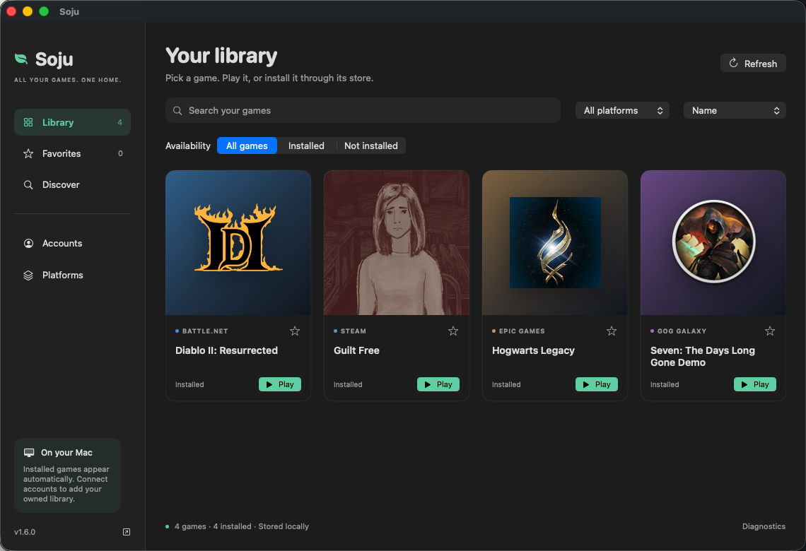

# Soju for Mac

[Download v1.6.0](https://github.com/BCD1210/soju/releases/download/v1.6.0/Soju-1.6.0-macos-arm64.zip)

1. Unzip and move **Soju.app** into Applications or ~/Applications.
2. Open **Platforms** to install or open Battle.net, Steam, Epic Games or GOG GALAXY.
3. Install games through the official clients and return to **Library**.
4. Search, filter by platform, star favorites and click a game's **Play** button.
   Use **Refresh** after installing a game or reconnecting an external game drive.
5. Open **Accounts** to connect Steam or import the owned library saved by Galaxy.
   Use the **Installed / Not installed** filter to choose what to play or install.
6. Open **Discover** to search Steam and GOG, select a price region, and visit
   the official product page. Epic and Battle.net have direct store search links.
7. Open a game's details for **Diagnose**, **Show files** and its official launcher.

The app is a native desktop preview. It is ad-hoc signed, not
Developer ID signed or notarized. If macOS blocks the downloaded app, review
the source and use macOS Privacy & Security's Open Anyway flow if you trust it.
A local source build is also available: `bash scripts/install-app.sh`.
Soju does not collect telemetry or upload diagnostic logs. Copy log is manual.

## Requirements

- Apple Silicon; the app UI runs on macOS 14 or later.
- Rosetta 2, Apple's Command Line Tools and Homebrew for launcher installation.
- The current Steam rendering package requires **macOS 26+ and Wine 11.0**.
  It was verified on M4 Pro / macOS 26.5. D3D11 support is not a guarantee that
  every game works; anti-cheat and individual game requirements still apply.
- Battle.net, Epic and GOG use the CX engine and a separate Apple GPTK download.
  Steam does not need either.

For Apple GPTK, install the selected non-Steam launcher to prepare the engine,
download Apple's evaluation environment, open its DMG, then choose
**Platforms → Apple GPTK → Add mounted toolkit**. Retry installation if it stopped.

The official clients retain their own login, library, downloads and game updates.
Soju does not handle store passwords. Close launchers and games before updating
their runtime. Closing Soju does not force running launchers or games to quit.

## Library scope and privacy

This release detects games installed in Soju's four Windows environments:

- Steam: app manifests and mapped library folders, including external drives.
- Epic: local installation manifests, excluding DLC-only records.
- Battle.net: Agent's product database and installed game build records.
- GOG: Galaxy's installation database, with a fallback for standard game folders.

Steam account imports use the official Steam website sign-in; no personal API key is needed. GOG imports
read the owned library cached by Galaxy on this Mac. Both include uninstalled
games. **Accounts → Disconnect** removes the import and Soju’s saved Steam web session.

Discover shows Steam and GOG listings, including add-ons and bundles, with prices
for US, Korea, UK, Germany or Japan. Purchases finish at the official store.
See [account setup and privacy](ACCOUNTS.md) for details.

Native Mac games, other Wine managers, and full Epic/Battle.net account imports
are outside this release's library scope.
Unknown Battle.net product codes are shown with a shortcut to the official client;
Soju does not guess how to launch them. **Installed** does not mean compatibility
has been verified. Anti-cheat, game requirements, store logins and updates still apply.

Artwork comes from Steam's local cache or icons already installed with games.
Extracted icons are cached under `~/.battlenet-macos/library-artwork`.
Favorites and recent launch requests stay in the app's local preferences.
Local scanning does not read store passwords or tokens and does not contact store APIs.
Explicit Steam sync contacts Valve; Discover contacts Steam/GOG and their artwork
CDNs. Steam authentication stays in Soju's local WebKit session. Only game metadata
is passed to the helper; Soju does not log cookies or tokens. Account snapshots are stored locally with private
file permissions in `~/.battlenet-macos/account-libraries`.
Play sends the official launcher a request; Soju does not claim to track whether
a game is running or how many hours were played.

CLI equivalents: `soju library` prints installed and imported owned games as JSON;
`soju game <id>` launches an ID from that list. Each launch rechecks the current
installation record. `python3 scripts/game-library.py launch <id> --dry-run`
prints the argument list without starting a game. `soju game-install <id>` opens
the official client to install an owned game. `soju search "Witcher" --country US`
searches Steam and GOG without an account.

## Updates and recovery

**Update components** checks the CX engine and configures the pinned Steam
components. Get new app releases from the link at the bottom of the sidebar or Platforms → Project & releases.
The app does not replace itself automatically.

Steam uses `~/.battlenet-macos/steam-runtime`; Homebrew's Wine app is preserved.
Existing Steam users can migrate with `soju steam-games` after closing Steam.
The installer retains the previous private runtime and a dated prefix settings
backup. Failed setup restores the prefix settings automatically.

Logs stay in `~/.battlenet-macos/logs`. Review logs before sharing them.
Launcher shortcuts use a managed script copy, so moving the desktop app later
does not invalidate existing shortcuts.
